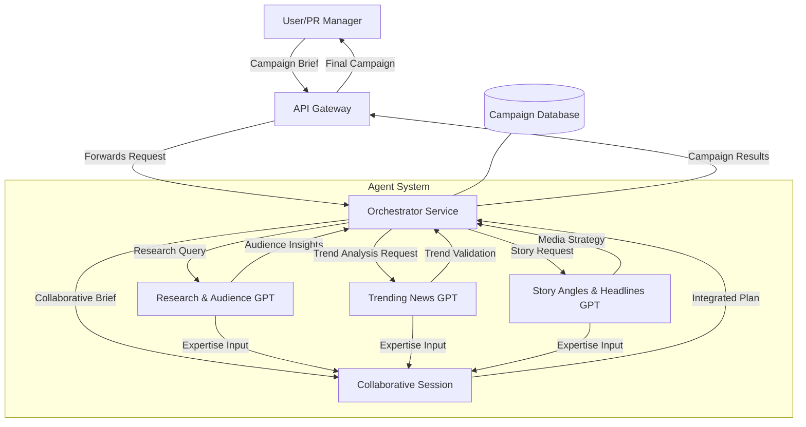
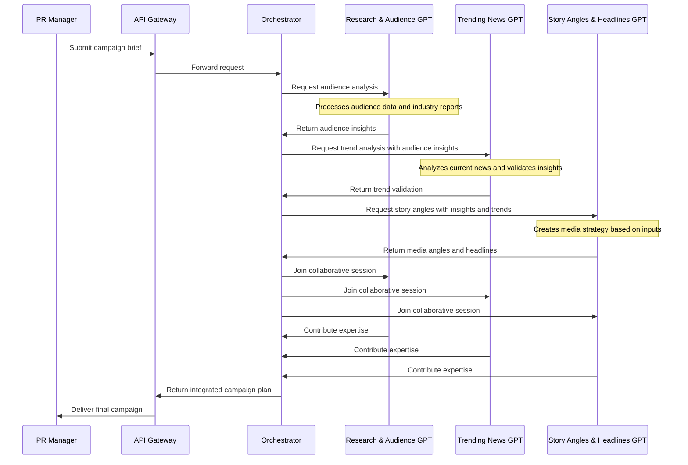
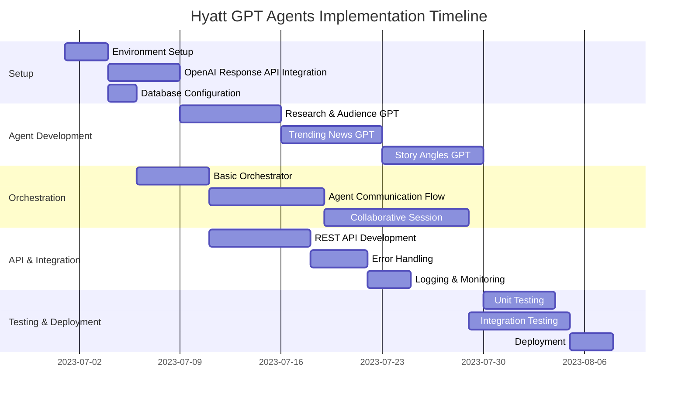
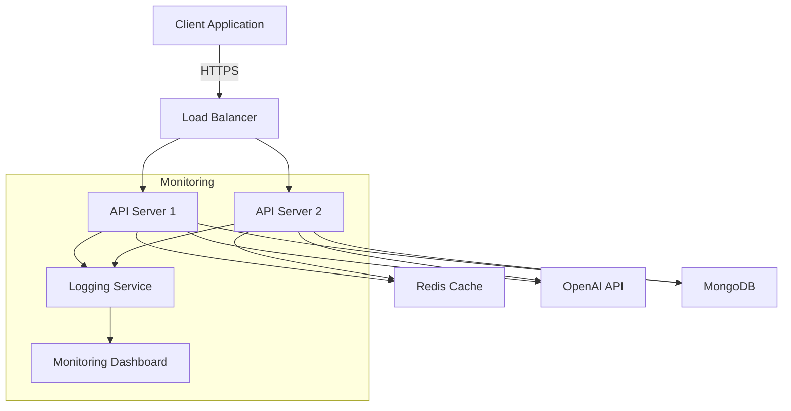

# Hyatt GPT Agents Implementation Plan

## System Overview

This document outlines the implementation plan for creating an interactive system of three specialized Hyatt GPT agents that can communicate with each other using OpenAI's Response API.



## Project Components

### 1. Agent Definitions

Each specialized GPT agent has its own system prompt, tools, and configuration:

| Agent                        | Primary Function    | Model       | Temperature | Tool Examples                                           |
| ---------------------------- | ------------------- | ----------- | ----------- | ------------------------------------------------------- |
| Research & Audience GPT      | Audience analysis   | gpt-4-turbo | 0.2         | query_audience_database, access_industry_reports        |
| Trending News GPT            | News trend analysis | gpt-4-turbo | 0.3         | search_news_api, trend_analyzer                         |
| Story Angles & Headlines GPT | Content creation    | gpt-4-turbo | 0.7         | media_outlet_database, headline_effectiveness_predictor |

### 2. Conversation Flow Sequence



## Technical Implementation

### Core API Structure

```javascript
// Sample code structure - server.js
const express = require("express");
const { OpenAI } = require("openai");
const app = express();
const port = process.env.PORT || 3000;

app.use(express.json());

const openai = new OpenAI({
  apiKey: process.env.OPENAI_API_KEY,
});

const orchestrator = new AgentOrchestrator(openai);

// Campaign creation endpoint
app.post("/api/campaigns", async (req, res) => {
  try {
    const { campaignBrief } = req.body;
    const campaignId = generateUniqueId();

    // Initialize the campaign workflow
    const campaign = await orchestrator.startCampaignSession(
      campaignId,
      campaignBrief
    );

    res.status(201).json({
      campaignId: campaign.id,
      status: campaign.status,
      message: "Campaign creation initiated",
    });
  } catch (error) {
    console.error("Campaign creation error:", error);
    res.status(500).json({ error: "Failed to create campaign" });
  }
});

// Additional endpoints...

app.listen(port, () => {
  console.log(`Hyatt GPT Agent system running on port ${port}`);
});
```

### Database Schema

```javascript
// Campaign document structure in MongoDB
{
  _id: ObjectId("..."),
  campaignId: "camp_12345",
  status: "in_progress", // "research", "trending", "story", "collaborative", "completed"
  brief: "Create a PR campaign for Hyatt's new eco-resort launch...",
  created_at: ISODate("2023-05-15T10:30:00Z"),
  updated_at: ISODate("2023-05-15T11:45:00Z"),

  // OpenAI thread IDs
  threads: {
    researchThread: "thread_abc123",
    trendingThread: "thread_def456",
    storyThread: "thread_ghi789",
    collaborativeThread: "thread_jkl012"
  },

  // Agent outputs
  outputs: {
    research: { /* Research GPT output */ },
    trending: { /* Trending News GPT output */ },
    storyAngles: { /* Story Angles GPT output */ },
    final: { /* Final collaborative output */ }
  }
}
```

### Orchestrator Implementation

```javascript
class AgentOrchestrator {
  constructor(openaiClient) {
    this.openai = openaiClient;
    this.assistantIds = {
      research: process.env.RESEARCH_ASSISTANT_ID,
      trending: process.env.TRENDING_ASSISTANT_ID,
      storyAngles: process.env.STORY_ASSISTANT_ID,
    };
    this.db = connectToDatabase();
  }

  async startCampaignSession(campaignId, brief) {
    // Create OpenAI threads for each agent
    const [researchThread, trendingThread, storyThread, collaborativeThread] =
      await Promise.all([
        this.openai.threads.create(),
        this.openai.threads.create(),
        this.openai.threads.create(),
        this.openai.threads.create(),
      ]);

    // Initialize campaign in database
    const campaign = await this.db.campaigns.insertOne({
      campaignId,
      status: "research",
      brief,
      created_at: new Date(),
      updated_at: new Date(),
      threads: {
        researchThread: researchThread.id,
        trendingThread: trendingThread.id,
        storyThread: storyThread.id,
        collaborativeThread: collaborativeThread.id,
      },
      outputs: {},
    });

    // Start the research phase asynchronously
    this.runResearchPhase(campaignId).catch(console.error);

    return {
      id: campaignId,
      status: "research",
    };
  }

  async runResearchPhase(campaignId) {
    const campaign = await this.db.campaigns.findOne({ campaignId });

    // Add the brief to the research thread
    await this.openai.threads.messages.create(campaign.threads.researchThread, {
      role: "user",
      content: campaign.brief,
    });

    // Run the research assistant on the thread
    const run = await this.openai.threads.runs.create(
      campaign.threads.researchThread,
      {
        assistant_id: this.assistantIds.research,
      }
    );

    // Wait for completion
    const result = await this.waitForRunCompletion(
      campaign.threads.researchThread,
      run.id
    );

    // Update campaign with research results
    await this.db.campaigns.updateOne(
      { campaignId },
      {
        $set: {
          status: "trending",
          "outputs.research": result,
          updated_at: new Date(),
        },
      }
    );

    // Continue to next phase
    this.runTrendingPhase(campaignId).catch(console.error);
  }

  // Additional phase methods follow similar pattern...
}
```

## Endpoint Reference

| Endpoint                       | Method | Description                                |
| ------------------------------ | ------ | ------------------------------------------ |
| `/api/campaigns`               | POST   | Create a new campaign session              |
| `/api/campaigns/{id}`          | GET    | Get campaign status and results            |
| `/api/campaigns/{id}/research` | GET    | Get research phase results                 |
| `/api/campaigns/{id}/trending` | GET    | Get trending phase results                 |
| `/api/campaigns/{id}/story`    | GET    | Get story angles phase results             |
| `/api/campaigns/{id}/final`    | GET    | Get final campaign plan                    |
| `/api/campaigns/{id}/advance`  | POST   | Manually advance to next phase (if needed) |

## Implementation Timeline



## Example Usage Scenario

### Creating a New Campaign

**Request:**

```http
POST /api/campaigns
Content-Type: application/json

{
  "campaignBrief": "We're launching a new eco-resort in Costa Rica next quarter. The property features regenerative design principles, carbon-positive operations, and deep community integration. Our target audience is environmentally-conscious Millennials and Gen Z travelers. Please develop a comprehensive PR campaign to announce this launch."
}
```

**Response:**

```http
HTTP/1.1 201 Created
Content-Type: application/json

{
  "campaignId": "camp_eco123456",
  "status": "research",
  "message": "Campaign creation initiated. Research phase in progress."
}
```

### Retrieving the Final Campaign

**Request:**

```http
GET /api/campaigns/camp_eco123456/final
```

**Response:**

```http
HTTP/1.1 200 OK
Content-Type: application/json

{
  "campaignId": "camp_eco123456",
  "status": "completed",
  "campaignPlan": {
    "corePositioning": "Beyond Sustainability: The World's First Regenerative Luxury Resort",
    "campaignPillars": [
      "Carbon-Positive Operations",
      "Community Regeneration",
      "Immersive Education",
      "Regenerative Cuisine",
      "Biophilic Wellness Design"
    ],
    "mediaStrategy": {
      "approach": "Lead with exclusive features in top tier outlets across different angles",
      "targetOutlets": [
        "Architectural Digest",
        "National Geographic Traveler",
        "Condé Nast Traveler",
        "Food & Wine",
        "Travel + Leisure"
      ]
    },
    "keyMessages": [
      "The resort actively restores ecosystems, not just minimizes harm",
      "Luxury and regeneration enhance each other, not compete",
      "Guests leave with transformative skills and experiences",
      "Local communities are partners and beneficiaries",
      "Every element follows regenerative principles"
    ],
    "launchTimeline": [
      {
        "phase": "Phase 1",
        "timing": "2 months pre-opening",
        "focus": "Architectural and design previews"
      },
      {
        "phase": "Phase 2",
        "timing": "1 month pre-opening",
        "focus": "Community impact stories"
      },
      {
        "phase": "Phase 3",
        "timing": "2 weeks pre-opening",
        "focus": "Culinary program features"
      },
      {
        "phase": "Phase 4",
        "timing": "Opening week",
        "focus": "Full media launch with experiential focus"
      },
      {
        "phase": "Phase 5",
        "timing": "Post-opening",
        "focus": "Ongoing educational content series"
      }
    ]
  }
}
```

## Technical Requirements

### Dependencies

```json
{
  "name": "hyatt-gpt-agents",
  "version": "1.0.0",
  "description": "Interactive GPT agent system for Hyatt PR campaigns",
  "main": "server.js",
  "scripts": {
    "start": "node server.js",
    "dev": "nodemon server.js",
    "test": "jest"
  },
  "dependencies": {
    "openai": "^1.3.0",
    "express": "^4.18.2",
    "mongoose": "^7.4.1",
    "dotenv": "^16.3.1",
    "cors": "^2.8.5",
    "helmet": "^7.0.0",
    "winston": "^3.10.0",
    "uuid": "^9.0.0"
  },
  "devDependencies": {
    "jest": "^29.6.2",
    "supertest": "^6.3.3",
    "nodemon": "^3.0.1"
  }
}
```

### Environment Variables

```
# OpenAI Configuration
OPENAI_API_KEY=sk-...
RESEARCH_ASSISTANT_ID=asst_...
TRENDING_ASSISTANT_ID=asst_...
STORY_ASSISTANT_ID=asst_...

# Database Configuration
MONGODB_URI=mongodb://...
DB_NAME=hyatt_campaigns

# Server Configuration
PORT=3000
NODE_ENV=development
```

## Deployment Architecture



## Next Steps

1. Set up the development environment with all dependencies
2. Create the OpenAI assistants with appropriate system prompts
3. Implement the orchestrator service with phase management
4. Build API endpoints for campaign management
5. Develop error handling and monitoring solutions
6. Test the system with sample campaign briefs
7. Deploy to staging environment for validation
8. Launch to production

---

This implementation plan provides a framework for building an interactive system of specialized GPT agents that can collaborate on PR campaign development through a sequential workflow with collaborative refinement.
